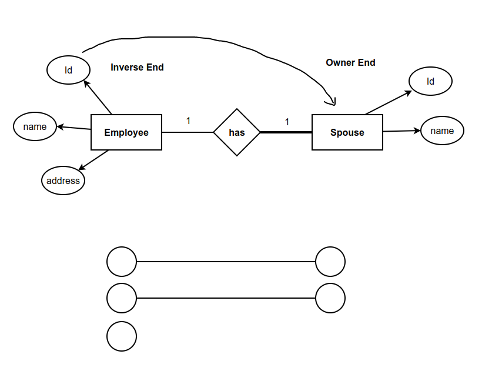
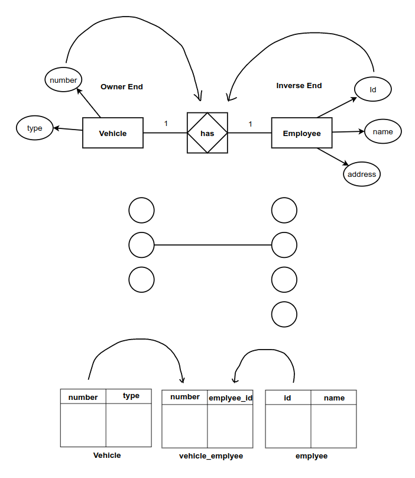
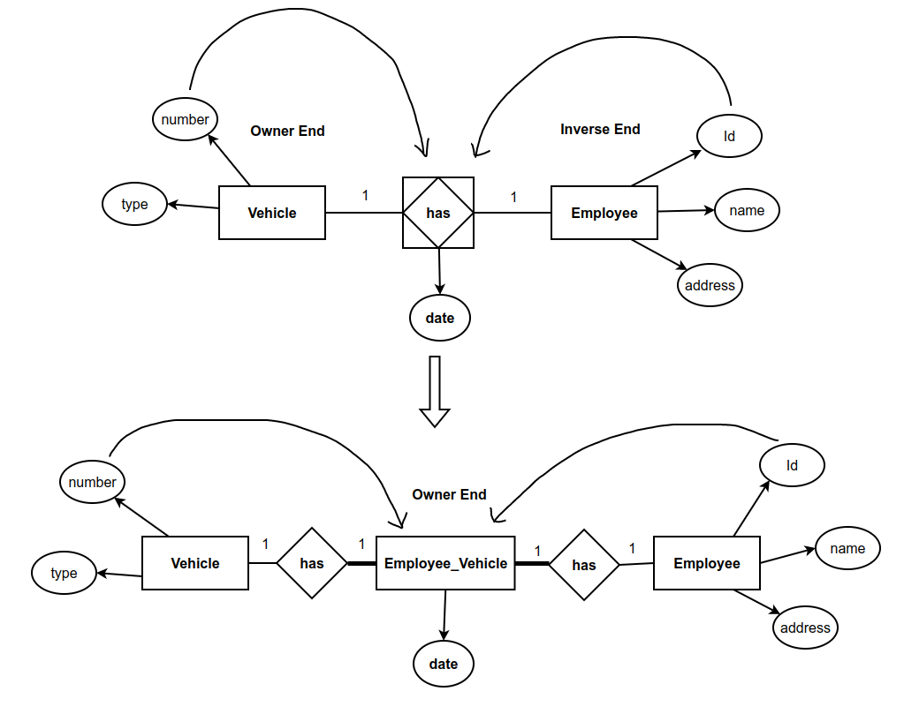
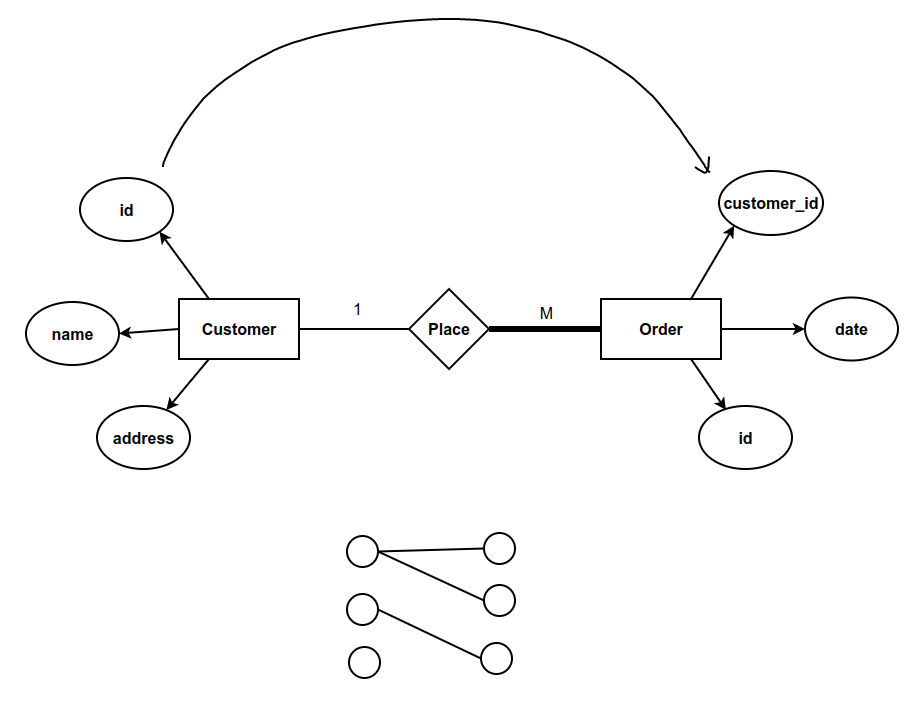
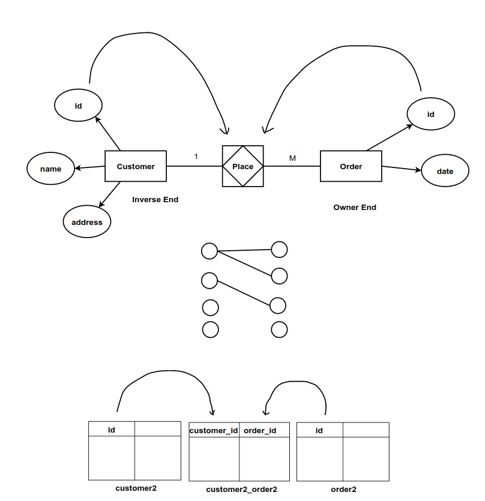
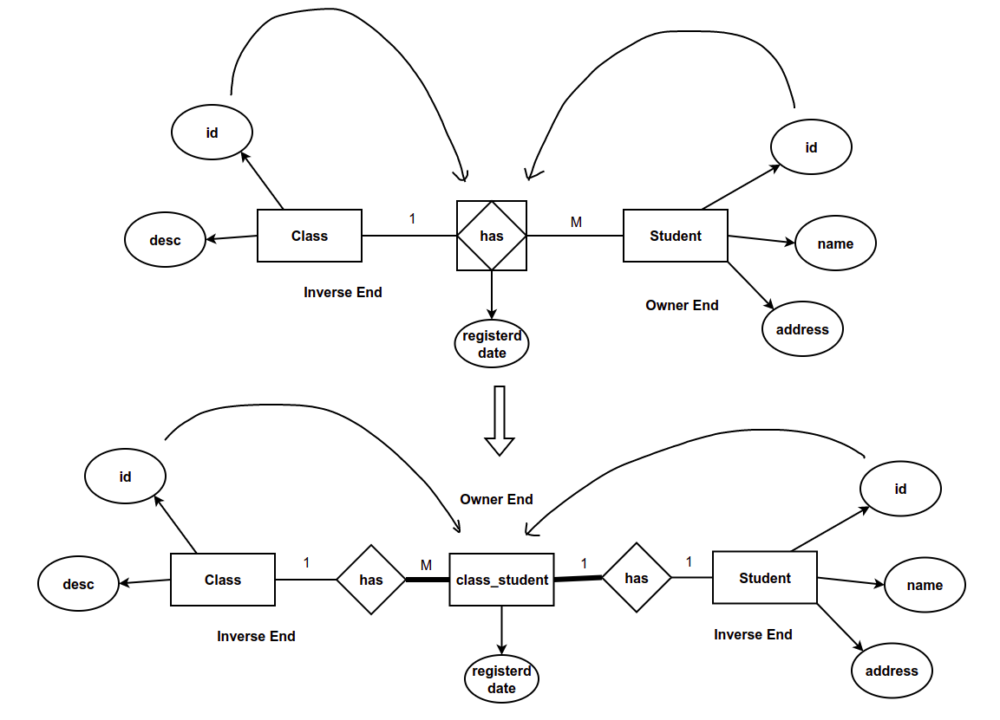
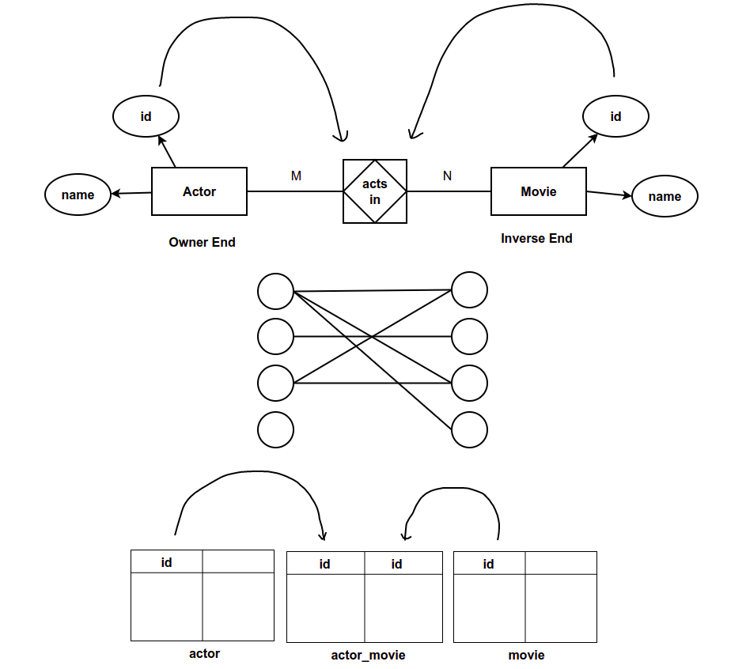
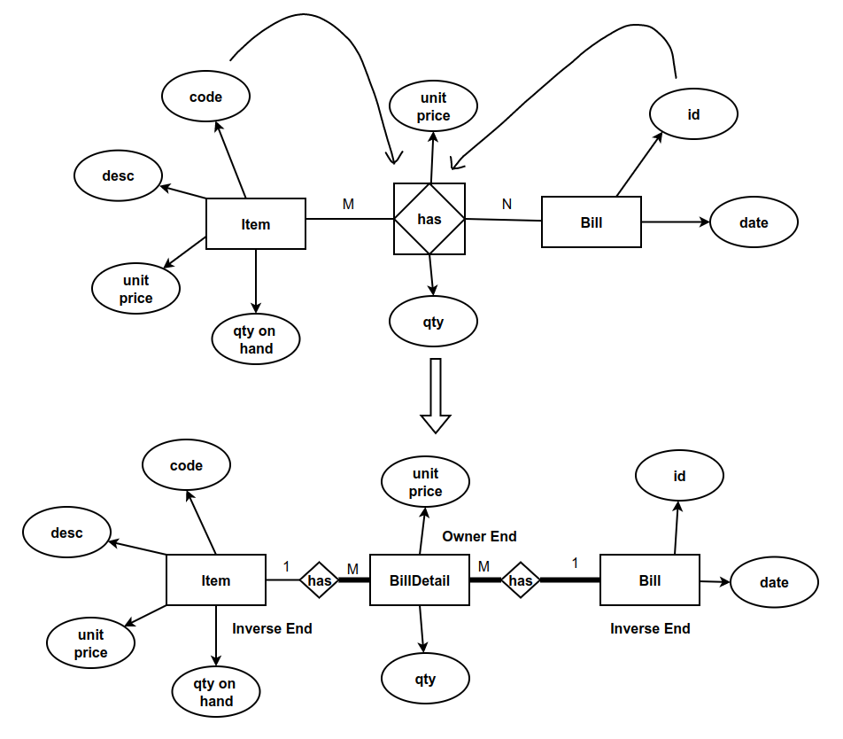

# JPA - Relationships

### 01. One to One Relationship - Total Participation



**Spouse**

```java
@Data
@AllArgsConstructor
@NoArgsConstructor
@Entity
@Table(name = "spouse")
public class Spouse implements Serializable {
    @Id
    private String id;
    @Column(nullable = false)
    private String name;
    @OneToOne
    @JoinColumn(name = "employee_id", referencedColumnName = "id", nullable = false, unique = true)
    private Employee employee;
}
```

**Employee**

```java
@Data
@NoArgsConstructor
@Entity
@Table(name = "employee")
public class Employee implements Serializable {
    @Id
    private String id;
    @Column(nullable = false)
    private String name;
    @Column(nullable = false)
    private String address;
    @OneToOne(mappedBy = "employee", cascade = {CascadeType.PERSIST, CascadeType.REMOVE})
    private Spouse spouse;

    public Employee(String id, String name, String address) {
        this.id = id;
        this.name = name;
        this.address = address;
    }

    public Employee(String id, String name, String address, Spouse spouse) {
        this.id = id;
        this.name = name;
        this.address = address;
        this.spouse = spouse;
        this.spouse.setEmployee(this);
    }

    public void setSpouse(Spouse spouse) {
        spouse.setEmployee(this);
        this.spouse = spouse;
    }

    @Override
    public String toString() {
        return "Employee{" +
                "id='" + id + '\'' +
                ", name='" + name + '\'' +
                ", address='" + address + '\'' +
                '}';
    }
}
```

We don’t override toString() in inverse end.

### 02. One to One Relationship - Partial Participation

**When there are no attributes be part of associate entity**



**Vehicle**

```java
@Data
@AllArgsConstructor
@NoArgsConstructor
@Entity
@Table(name = "vehicle")
public class Vehicle implements Serializable {
    @Id
    private String number;
    @Column(nullable = false)
    private String type;
    @OneToOne
    @JoinTable(name = "vehicle_employee",
            joinColumns = @JoinColumn(name = "number", referencedColumnName = "number", unique = true),
            inverseJoinColumns = @JoinColumn(name = "employee_id", referencedColumnName = "id", unique = true))
    private Employee employee;

    public Vehicle(String number, String type) {
        this.number = number;
        this.type = type;
    }

```

**Employee**

```java
@Data
@NoArgsConstructor
@Entity
@Table(name = "employee")
public class Employee implements Serializable {
    @Id
    private String id;
    @Column(nullable = false)
    private String name;
    @Column(nullable = false)
    private String address;
    @OneToOne(mappedBy = "employee", cascade = {CascadeType.PERSIST})
    private Vehicle vehicle;

    public Employee(String id, String name, String address) {
        this.id = id;
        this.name = name;
        this.address = address;
    }

    public Employee(String id, String name, String address, Vehicle vehicle) {
        this.id = id;
        this.name = name;
        this.address = address;
        this.vehicle = vehicle;
        this.vehicle.setEmployee(this);
    }

    public void setVehicle(Vehicle vehicle) {
        vehicle.setEmployee(this);
        this.vehicle = vehicle;
    }

    @Override
    public String toString() {
        return "Employee{" +
                "id='" + id + '\'' +
                ", name='" + name + '\'' +
                ", address='" + address + '\'' +
                '}';
    }
}
```

**Decompose:** **When there are attributes be part of associate entity**



**Employee2**

```java
@Data
@NoArgsConstructor
@AllArgsConstructor
@Entity
@Table(name = "employee2")
public class Employee2 implements Serializable {
    @Id
    private String id;
    @Column(nullable = false)
    private String name;
    @Column(nullable = false)
    private String address;
}
```

**Vehicle2**

```java
@Data
@AllArgsConstructor
@NoArgsConstructor
@Entity
@Table(name = "vehicle2")
public class Vehicle2 implements Serializable {
    @Id
    private String number;
    @Column(nullable = false)
    private String type;
    @Setter(AccessLevel.NONE)
    @OneToOne(mappedBy = "vehicle2", cascade = CascadeType.PERSIST)
    private Vehicle2Employee2 vehicle2Employee2;

    public Vehicle2(String number, String type) {
        this.number = number;
        this.type = type;
    }

    @Override
    public String toString() {
        return "Vehicle2{" +
                "number='" + number + '\'' +
                ", type='" + type + '\'' +
                '}';
    }
}
```

**Vehicle2Employee2**

```java
@Data
@AllArgsConstructor
@NoArgsConstructor
@Entity
@Table(name = "vehicle2_employee2")
public class Vehicle2Employee2 implements Serializable {
    @EmbeddedId
    private Vehicle2Employee2PK vehicle2Employee2PK;
    private Date date;
    @Setter(AccessLevel.NONE)
    @OneToOne(cascade = CascadeType.ALL)
    @JoinColumn(name = "number", referencedColumnName = "number", insertable = false, updatable = false)
    private Vehicle2 vehicle2;
    @Setter(AccessLevel.NONE)
    @OneToOne(cascade = CascadeType.ALL)
    @JoinColumn(name = "id", referencedColumnName = "id", insertable = false, updatable = false)
    private Employee2 employee2;

    public Vehicle2Employee2(String number, String id, Date date) {
        this.vehicle2Employee2PK = new Vehicle2Employee2PK(number, id);
        this.date = date;
    }

    public Vehicle2Employee2(Vehicle2Employee2PK vehicle2Employee2PK, Date date) {
        this.vehicle2Employee2PK = vehicle2Employee2PK;
        this.date = date;
    }
}
```

**Vehicle2Employee2PK**

```java
@Data
@AllArgsConstructor
@NoArgsConstructor
@Embeddable
public class Vehicle2Employee2PK implements Serializable {
    @Column(unique = true)
    private String number;
    @Column(unique = true)
    private String id;
}
```

### 03. One to Many Relationship - Total Participation



**Order**

```java
@Data
@AllArgsConstructor
@NoArgsConstructor
@Entity
@Table(name = "`order`")
public class Order implements Serializable {
    @Id
    private String id;
    @Column(nullable = false)
    private Date date;
    @ManyToOne(cascade = CascadeType.ALL)
    @JoinColumn(name = "customer_id", referencedColumnName = "id", nullable = false)
    private Customer customer;
}
```

**Customer**

```java
@Data
@AllArgsConstructor
@NoArgsConstructor
@Entity
@Table(name = "customer")
public class Customer implements Serializable {
    @Id
    private String id;
    @Column(nullable = false)
    private String name;
    @Column(nullable = false)
    private String address;
    @OneToMany(mappedBy = "customer")
    private List<Order> orderList;

    public Customer(String id, String name, String address) {
        this.id = id;
        this.name = name;
        this.address = address;
    }

    public void setOrderList(List<Order> orderList) {
        orderList.forEach(order -> order.setCustomer(this));
        this.orderList = orderList;
    }

    public void addOrder(Order order) {
        order.setCustomer(this);
        this.orderList.add(order);
    }

    @Override
    public String toString() {
        return "Customer{" +
                "id='" + id + '\'' +
                ", name='" + name + '\'' +
                ", address='" + address + '\'' +
                '}';
    }
}
```

### 04. One To Many Relationship - Partial Participation

**When there are no attributes be part of associate entity**



**Order2**

```java
@Data
@AllArgsConstructor
@NoArgsConstructor
@Entity
@Table(name = "order2")
public class Order2 implements Serializable {
    @Id
    private String id;
    @Column(nullable = false)
    private Date date;
    @ManyToOne(cascade = CascadeType.PERSIST)
    @JoinTable(name = "customer2_order2",
                        joinColumns = @JoinColumn(name = "order_id", referencedColumnName = "id"),
                        inverseJoinColumns = @JoinColumn(name = "customer_id", referencedColumnName = "id"))
    private Customer2 customer2;

    public Order2(String id, Date date) {
        this.id = id;
        this.date = date;
    }
}
```

**Customer2**

```java
@Data
@AllArgsConstructor
@NoArgsConstructor
@Entity
@Table(name = "customer2")
public class Customer2 implements Serializable {
    @Id
    private String id;
    @Column(nullable = false)
    private String name;
    @Column(nullable = false)
    private String address;
    @OneToMany(mappedBy = "customer2")
    private List<Order2> order2List;

    public Customer2(String id, String name, String address) {
        this.id = id;
        this.name = name;
        this.address = address;
    }

    public void setOrder2List(List<Order2> order2List) {
        order2List.forEach(order2 -> order2.setCustomer2(this));
        this.order2List = order2List;
    }

    public void addOrder(Order2 order2) {
        order2.setCustomer2(this);
        this.getOrder2List().add(order2);
    }

    public void removeOrder(Order2 order2) {
        this.order2List.remove(order2);
        order2.setCustomer2(null);
    }

    @Override
    public String toString() {
        return "Customer2{" +
                "id='" + id + '\'' +
                ", name='" + name + '\'' +
                ", address='" + address + '\'' +
                '}';
    }
}
```

**Decompose:** **When there are attributes be part of associate entity**



**ClassStudent**

```java
@Data
@AllArgsConstructor
@NoArgsConstructor
@Entity
@Table(name = "class_student")
public class ClassStudent implements Serializable {
    @EmbeddedId
    private ClassStudentPK classStudentPK;
    @Column(nullable = false)
    private Date date;
    @Setter(AccessLevel.NONE)
    @ManyToOne(cascade = CascadeType.PERSIST)
    @JoinColumn(name = "class_id", referencedColumnName = "id", insertable = false, updatable = false)
    private Class classRef;
    @OneToOne(cascade = CascadeType.PERSIST)
    @JoinColumn(name = "student_id", referencedColumnName = "id", insertable = false, updatable = false)
    private Student student;

    public ClassStudent(ClassStudentPK classStudentPK, Date date) {
        this.classStudentPK = classStudentPK;
        this.date = date;
    }

    public ClassStudent(String classId, String studentId, Date date) {
        this.classStudentPK = new ClassStudentPK(classId, studentId);
        this.date = date;
    }

    public ClassStudent(ClassStudentPK classStudentPK, Date date, Student student) {
        this.classStudentPK = classStudentPK;
        this.date = date;
        this.student = student;
    }
}
```

**ClassStudentPK**

```java
@Data
@AllArgsConstructor
@NoArgsConstructor
@Embeddable
public class ClassStudentPK implements Serializable {
    @Column(name = "class_id")
    private String classId;
    @Column(name = "student_id", unique = true)
    private String studentId;
}
```

**Class**

```java
@Data
@AllArgsConstructor
@NoArgsConstructor
@Entity
@Table(name = "class")
public class Class implements Serializable {
    @Id
    private String id;
    @Column(nullable = false)
    private String description;
    @OneToMany(mappedBy = "classRef", cascade = CascadeType.PERSIST)
    List<ClassStudent> classStudentList;

    public Class(String id, String description) {
        this.id = id;
        this.description = description;
    }

    @Override
    public String toString() {
        return "Class{" +
                "id='" + id + '\'' +
                ", description='" + description + '\'' +
                '}';
    }
}
```

**Student**

```java
@Data
@NoArgsConstructor
@Entity
@Table(name = "student")
public class Student implements Serializable {
    @Id
    private String id;
    @Column(nullable = false)
    private String name;
    @Column(nullable = false)
    private String address;
    @OneToOne(mappedBy = "student", cascade = CascadeType.PERSIST)
    private ClassStudent classStudent;

    public Student(String id, String name, String address) {
        this.id = id;
        this.name = name;
        this.address = address;
    }

    public Student(String id, String name, String address, ClassStudent classStudent) {
        this.id = id;
        this.name = name;
        this.address = address;
        this.classStudent = classStudent;
        this.classStudent.getClassStudentPK().setStudentId(this.id);
    }

    @Override
    public String toString() {
        return "Student{" +
                "id='" + id + '\'' +
                ", name='" + name + '\'' +
                ", address='" + address + '\'' +
                '}';
    }
}
```

### 05. Many To many Relationship

**When there are no attributes be part of associate entity**



**Actor**

```java
@Data
@AllArgsConstructor
@NoArgsConstructor
@Entity
@Table(name = "actor")
public class Actor implements Serializable {
    @Id
    private String id;
    @Column(nullable = false)
    private String name;
    @ManyToMany
    @JoinTable(name = "actor_movie",
                joinColumns = @JoinColumn(name = "actor_id", referencedColumnName = "id"),
                inverseJoinColumns = @JoinColumn(name = "movie_id", referencedColumnName = "id"))
    private Set<Movie> movieList = new HashSet<>();

    public Actor(String id, String name) {
        this.id = id;
        this.name = name;
    }
}
```

**Movie**

```java
@Data
@NoArgsConstructor
@Entity
@Table(name = "movie")
public class Movie implements Serializable {
    @Id
    private String id;
    @Column(nullable = false)
    private String name;
    @ManyToMany(mappedBy = "movieList", cascade = CascadeType.PERSIST)
    private List<Actor> actorList;

    public Movie(String id, String name) {
        this.id = id;
        this.name = name;
    }

    public Movie(String id, String name, List<Actor> actorList) {
        this.id = id;
        this.name = name;
        this.actorList = actorList;
        this.actorList.forEach(actor -> actor.getMovieList().add(this));
    }

    public void addActor(Actor actor) {
        actorList.add(actor);
        actor.getMovieList().add(this);
    }

    public void removeActor(Actor actor) {
        actor.getMovieList().remove(this);
        this.actorList.remove(actor);
    }

    public void setActorList(List<Actor> actorList) {
        actorList.forEach(actor -> actor.getMovieList().add(this));
        this.actorList = actorList;
    }

    @Override
    public String toString() {
        return "Movie{" +
                "id='" + id + '\'' +
                ", name='" + name + '\'' +
                '}';
    }
}
```

**Decompose:** **When there are attributes be part of associate entity**



**Bill**

```java
@Data
@AllArgsConstructor
@NoArgsConstructor
@Entity
@Table(name = "bill")
public class Bill implements Serializable {
    @Id
    private String id;
    @Column(nullable = false)
    private Date date;
    @OneToMany(mappedBy = "bill", cascade = {CascadeType.PERSIST}, fetch = FetchType.EAGER)
    private List<BillDetail> billDetailList;

    public Bill(String id, Date date) {
        this.id = id;
        this.date = date;
    }

    @Override
    public String toString() {
        return "Bill{" +
                "id='" + id + '\'' +
                ", date=" + date +
                '}';
    }
}
```

**Item**

```java
@Data
@AllArgsConstructor
@NoArgsConstructor
@Entity
@Table(name = "item")
public class Item implements Serializable {
    @Id
    private String code;
    @Column(nullable = false)
    private String description;
    @Column(name = "qty_on_hand",nullable = false)
    private int qtyOnHand;
    @Column(name = "unit_price",nullable = false)
    private BigDecimal unitPrice;
    @OneToMany(mappedBy = "item", cascade = {CascadeType.PERSIST})
    private List<BillDetail> billDetailList;

    public Item(String code, String description, int qtyOnHand, BigDecimal unitPrice) {
        this.code = code;
        this.description = description;
        this.qtyOnHand = qtyOnHand;
        this.unitPrice = unitPrice;
    }

    @Override
    public String toString() {
        return "Item{" +
                "code='" + code + '\'' +
                ", description='" + description + '\'' +
                ", qtyOnHand=" + qtyOnHand +
                ", unitPrice=" + unitPrice +
                '}';
    }
}
```

**BilDetailPK**

```java
@Data
@AllArgsConstructor
@NoArgsConstructor
@Embeddable
public class BillDetailPK implements Serializable {
    @Column(name = "item_code")
    private String itemCode;
    @Column(name = "bill_id")
    private String billId;
}
```

**BillDetail**

```java
@Data
@AllArgsConstructor
@NoArgsConstructor
@Entity
@Table(name = "bill_detail")
public class BillDetail implements Serializable {
    @EmbeddedId
    private BillDetailPK billDetailPK;
    @Column(nullable = false)
    private int qty;
    @Column(name = "unit_price", nullable = false)
    private BigDecimal unitPrice;
    @Setter(AccessLevel.NONE)
    @ManyToOne(cascade = CascadeType.PERSIST)
    @JoinColumn(name = "item_code", referencedColumnName = "code", insertable = false, updatable = false)
    private Item item;
    @Setter(AccessLevel.NONE)
    @ManyToOne(cascade = CascadeType.PERSIST)
    @JoinColumn(name = "bill_id", referencedColumnName = "id", insertable = false, updatable = false)
    private Bill bill;

    public BillDetail(String itemCode, String billId, int qty, BigDecimal unitPrice) {
        this.billDetailPK = new BillDetailPK(itemCode, billId);
        this.qty = qty;
        this.unitPrice = unitPrice;
    }

    public BillDetail(BillDetailPK billDetailPK, int qty, BigDecimal unitPrice) {
        this.billDetailPK = billDetailPK;
        this.qty = qty;
        this.unitPrice = unitPrice;
    }
}
```
